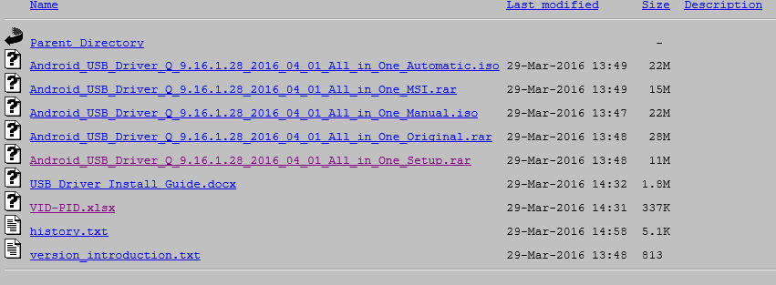
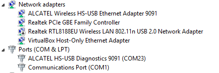
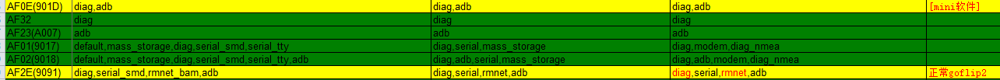

*All_in_One是公司开发的手机驱动
*u2: lsbusb
*win: device manager

*驱动位置：
    https://webampbis.tcl-ta.com/TELEWEB/TELEWEB/TOOLS/TELEWEB/delivery/2_Qualcomm/Driver/ALL_IN_ONE/
Android_USB_Driver_Q_9.16.1.28_2016_04_01_All_in_One_Setup.rar

*安装目录：
    C:\Program Files (x86)\Android USB Driver Manager\win8164   [win8.1 64位]

*使用：
    device manager: 有两个问号
    打开All_in_one，点击install，真正装驱动，消掉一个问号
    Ports(COM & LPT)
        ALCATEL HS-USB Diagnostics 9091(COM23)
    还有一个问号要手动update driver, 因为以前装过旧的驱动
    Network adapters
        ALCATEL Wireless HS-USB Ethernet Adapter 9091

