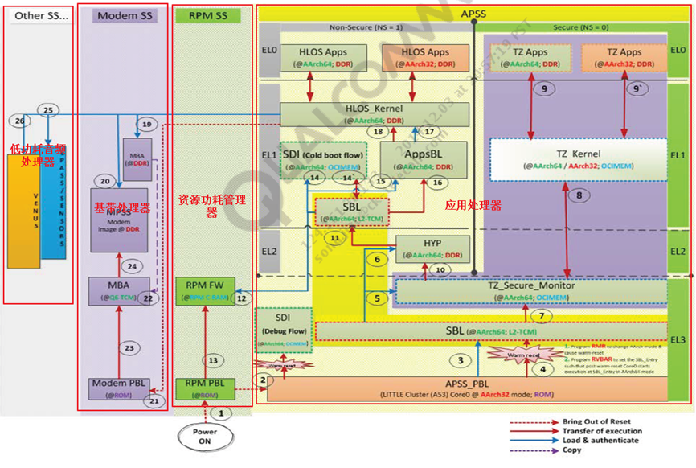

# [F200引导装载程序 (Bootloader) & 术语](!http://bbs.gfan.com/android-5883867-1-1.html)

# BootLoader

BootLoader是在操作系统内核运行之前运行。可以初始化硬件设备、建立内存空间映射图，从而将系统的软硬件环境带到一个合适状态，以便为最终调用操作系统内核准备好正确的环境。BootLoader的主要运行任务就是将内核映象从硬盘上读到 RAM 中，然后跳转到内核的入口点去运行，也即开始启动操作系统。
The boot loader has to perform the following tasks:
·       Bring the kernel into memory
·       Provide the kernel with the information it needsto work
·       Switch to the work space that the kernel will workon
·       Release itself and transfer control to thekernel
At present,the popular bootloaders on the market are: redboot, U-boot, Blob, vivi, xboot,little kernel, etc.  Many ARM embeddedsystems are using U-boot as the bootloader for their development boards.  Recently, the Little Kernel(LK) has beenadopted by Qualcomm, TI, Samsung, Telechips, etc.

# [高通msm8994启动流程简介](http://blog.csdn.net/finewind/article/details/46469645)

